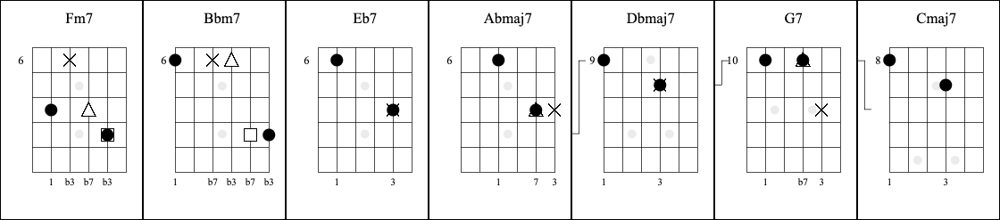

# Guitar Diagram Toolkit
Handcrafted for personal needs, provides a unique guitar diagram authoring experience for arranging music using pure guitar diagrams, inspired by Ted Greene and Tim Lerch.

<figure>
  
  <figcaption>↑ Sample arrangement of the beginning of the jazz standard 'All The Things You Are'.</figcaption>
</figure>

## Arrangement

### Symbols

It's my understanding that Ted Greene was the original creator (or at least heavily popularized) his unique <a href="https://www.tedgreene.com/images/lessons/students/paulvachon/howtoreadtedgreenechorddiagrams.pdf" target="_blank">system of notation</a>.  In short, his guitar diagrams convey both a landing chord, and subsequent melody notes, before moving onto the next diagram.  Ted's original idea for how he sequenced the landing chord and following melody notes was (Circle, X, Square, Triangle, Star).

Having come across some books by one of Ted's former students (Tim Lerch), I took notice of a proposed change to the above symbol ordering based on the # of strokes, which I found logically easier to remember.  I also decided to replace the `Star` symbol with a `Pentagon`.  My personal system is as follows:

| Shape      | Function       | # of Strokes |
| ---------- | -------------- | ------------ |
| `Circle`   | chord          | 1            |
| `X`        | melody note 1  | 2            |
| `Triangle` | melody note 2  | 3            |
| `Square`   | melody note 3  | 4            |
| `Pentagon` | melody note 4+ | 5            |

### Connect

The `connect` dropdown allows the arranger to visually align the frets between neighboring diagrams.  This helps your eyes better track the magnitude and direction of the shift.  If the connector shifts up between diagrams, that means you're going up in pitch, and likewise down being down in pitch.  To assign a connector, you simply need to think of a guitar diagram as having 5 horizontal fret slots (A, B, C, D, E), and when positioning two next to one another, determine if you want to connect, for example, slot A to slot C, in which case you'd choose `A-C`.

### Beats

The `beats` dropdown allows you to embed how many beats the given guitar diagram represents.

### Musical Interpretation

This notation is less prescriptive than standard notation and guitar tab.  It generally requires some basic familiarity with the melody already and assumes the player will comp a suitable rhythm to support the overarching melody.

## Hotkeys

For those with a full keyboard, I have added convenient shortcuts to the numpad section as follows:

| Shortcut | Function                                                                     |
| -------- | ---------------------------------------------------------------------------- |
| Numpad0  | Hides the editor if you'd like to view your arrangement without distraction. |
| Numpad1  | Selects: `Circle`                                                            |
| Numpad2  | Selects: `X`                                                                 |
| Numpad3  | Selects: `Triangle`                                                          |
| Numpad4  | Selects: `Square`                                                            |
| Numpad5  | Selects: `Pentagon`                                                          |
| Numpad6  | Selects: `Erase`                                                             |

## Credits
Copyright © 2024 <a href="https://github.com/christopherball" target="_blank">Christopher Ball</a> 
License: <a href="https://github.com/christopherball/guitarDiagramToolkit/blob/main/LICENSE">MIT License</a>, Source: <a href="https://github.com/christopherball/guitarDiagramToolkit">Github</a> 